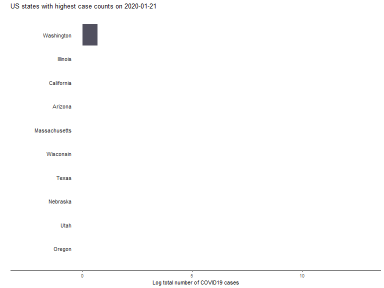

<!-- Feel free to edit theme / highlight in the YAML header above -->

```{r setup, echo=TRUE, message = FALSE, warning = FALSE}

knitr::opts_chunk$set(echo = TRUE)

# Load libraries for homework problems
library(tidyverse)
library(gt)
library(patchwork)

# Read in COVID-19 data
# R/make_data.R creates this file
cv19 <- read_csv('data/usa_covid19.csv')

```


# Overview

The COVID-19 pandemic is an ongoing public health emergency in the United States (US) and worldwide. Since `r min(cv19$date)`, the New York times has monitored and shared COVID-19 data (see [github repo here](https://github.com/nytimes/covid-19-data)) from across the US at the state and county level. 

## Data dictionary

I have modified the New York times data to include information about state's population levels. The data are described below: 

```{r}

c("date" = "Date", 
  "state" =  "State in the US", 
  "cases_total" = "Total number of cases as of date", 
  "deaths_total" = "Total number of deaths as of date",
  "pop_2015" = "Estimated population as of 2015"
) %>% 
  enframe() %>% 
  gt(rowname_col = "name") %>%
  tab_stubhead(label = 'Variable name') %>% 
  cols_label(value = 'Variable description') %>% 
  cols_align('right') %>% 
  tab_footnote(locations = cells_body(rows = 5, columns = 2),
    footnote = "Source: usmap::countypop") %>% 
  tab_footnote(locations = cells_body(columns = 2, rows = 2), 
    footnote = 'US = United States') %>% 
  tab_header(title = 'Dictionary for New York Times COVID-19 data',
    subtitle = paste("Last updated:", max(cv19$date)))
  
```

## Data pages

The data (`cv19`) are printed below:

```{r}

cv19

```


# Problem 1

Create two new columns in `cv19`: 

- `cases_new` the number of _new_ cases identified on a given day for a given state.

- `deaths_new` the number of _new_ deaths confirmed on a given day for a given state.


__Notes__: 

- the `lag()` function is helpful for this.

- Your solution should look like this

```{r}

read_rds('solutions/01_solution.rds')

```

# Problem 2

Compute the total number of new cases identified and deaths confirmed each day in the USA on or after March 1st, 2020. Your summarized data should look like this:

```{r}

read_rds('solutions/02_solution.rds')

```


# Problem 3

Using the data created in problem 2, create two bar plots showing the number of new cases identified and deaths confirmed in the USA after March 1st, 2020.

__Notes__ This is a great chance to learn about the [patchwork R package](https://patchwork.data-imaginist.com/). 

Your solution should look like this

```{r, fig.width=10}

read_rds('solutions/03_solution.rds')

```


# Problem 4

Using the data from problem 1, create the table below:

```{r}

read_rds('solutions/04_solution.rds')

```

Hints: 

To create the dataset that will generate this table, you will likely need to 
- filter the data from problem 1 to contain the 2 most recent weeks. 

- derive the following columns: 

    + `cases_per100k`: Number of cases per 100,000 citizens 

    + `deaths_per100k`: Number of deaths per 100,000 citizens

    + `cases_mar`: Number of days until case count doubles, based on current     day's case count 
    
    + `deaths_mar`: Number of days until death count doubles, based on
    current day's death count. 

- filter your data down to the 10 states that have the highest death rate per 100,000 citizens. 

# Problem 5

__Learn something new__: take a look at a famous [flipbook](https://evamaerey.github.io/little_flipbooks_library/racing_bars/racing_barcharts.html#1) created by Gina Reynolds. The `cv19` data have a very similar structure to that of the flipbook in Gina's talk. Learn about the `ggplot2` tools that are used in the flipbook and try to adapt them to create the 'racing bar chart' below. 




